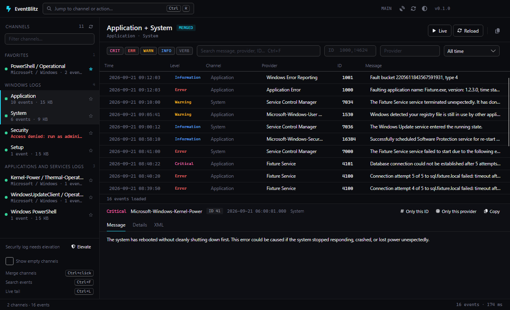

| Ctrl+L | live tail on/off |
| Ctrl+Shift+A | alerts page |# EventBlitz

A fast, searchable viewer for the Windows Event Log — the built-in Event Viewer rebuilt as a dense, keyboard-first
ops console. Avalonia · .NET 10 · one portable exe.



## What it does

- **Every channel of the machine** in one sidebar: Windows Logs, Applications and Services Logs, your favourites
  pinned on top, with record counts and sizes. Empty channels are hidden until you ask for them.
- **Merged view** — Ctrl+click several channels and read their events as one list in time order (Application +
  System + Kernel-Power/Thermal, for example).
- **Filters that stream** — level chips, time range, event IDs (`1000, 1001-1010, !4624`), provider, and a
  full-text search that walks the whole log and shows matches as they are found, with a live "scanned" counter and
  a Stop button. Level, time and IDs are pushed down to the Event Log as XPath; text runs on the formatted message.
- **Live tail** (Ctrl+L) — new events are inserted at the top the moment they are written.
- **Alerts** (Ctrl+Shift+A) — subscribe to channels with a level / ID / provider / text condition; a rule watches in
  the background whatever you are looking at and fires a sound, a toast in the corner and a taskbar flash. "New from
  current view" makes a rule out of the channels and filter on screen; every hit is listed and opens the event on click.
- **Detail pane** with the message, every system property (task, keywords, user, PID/TID, activity ID…) and the
  raw XML; "only this ID" / "only this provider" turn an event into a filter with one click.
- **Command palette** (Ctrl+K) across channels, filters and actions; theme switch System / Light / Dark (System follows Windows live); restart as
  administrator when the Security log is needed.
- Self-updating from GitHub Releases (stable = tagged releases, nightly = every push to master).

## Run

Download `EventBlitz-win-x64.zip` from the [latest release](https://github.com/TomasBouda/EventBlitz/releases/latest),
unzip and start `EventBlitz.exe`. No installation; settings live in `%APPDATA%\EventBlitz`, the app's own log in
`%LOCALAPPDATA%\EventBlitz\logs`. `EventBlitz --health` prints the health document.

## Build

```bash
git clone https://github.com/TomasBouda/EventBlitz.git
dotnet build EventBlitz.slnx
dotnet test tests/EventBlitz.Core.Tests/EventBlitz.Core.Tests.csproj
dotnet run --project src/EventBlitz.App
```

`src/EventBlitz.Core` reads the log (`System.Diagnostics.Eventing.Reader`), builds XPath from the filter and merges
channels; `src/EventBlitz.App` is the Avalonia UI. The self-update library `TomLabs.AutoUpdate.Avalonia` comes from nuget.org.

## Keyboard

| Key | Action |
|---|---|
| Ctrl+K | command palette |
| Ctrl+F | search events |
| Ctrl+L | live tail on/off |
| F5 | reload |
| Esc | stop a running search |
| Ctrl+C | copy the selected event |
| Ctrl+Shift+X | clear filters |
| Ctrl+Shift+L | theme: system → light → dark |
| Ctrl+click | merge channels |

## License

MIT. Alert sounds from freesound.org: "Message Notification 4" by AnthonyRox ([s/740423](https://freesound.org/s/740423/), CC0)
and "Error Bleep 1" by original_sound ([s/372200](https://freesound.org/s/372200/), [CC BY 3.0](https://creativecommons.org/licenses/by/3.0/));
the sources live in `tools/sounds` and `tools/Make-Sounds.ps1` converts them to the shipped assets.
